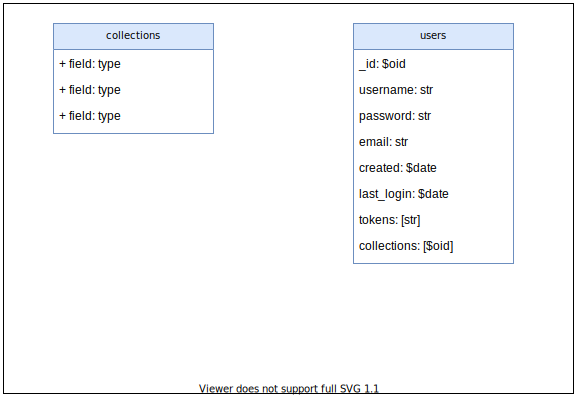
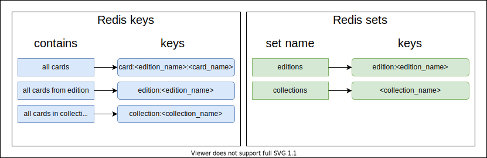

# MTG_Collection
## About
This app lets you create custom collections, and save all magic cards you want into them. You can then check collection price values, number of cards, as well as information about cards themselves (price, date published, ...).  
All cards data is currently from [Scryfall](https://scryfall.com/).
## How to run locally

### 1. Install and start Docker

### 2. Build and start app
`docker-compose up --build`

### 3. Initialize Redis database
Database is loaded from .rdb file in /mtg_collection/data/.  
If this file is missing, you need to init db first.  
* At first run, you need to download json file containing all mtg cards, you can do it by clicking 'Download data' button.
* After downloading file, initialize database by clicking 'Synchronize database' button.

## How does it work
TODO: Create collection -> add cards -> check prices etc.

## Backup
TODO: save to csv/json then import from that.

## MongoDB 
Database contains all users, and their collections with cards.  

## Redis

Database currently contains all cards, all sets and all created collections.

